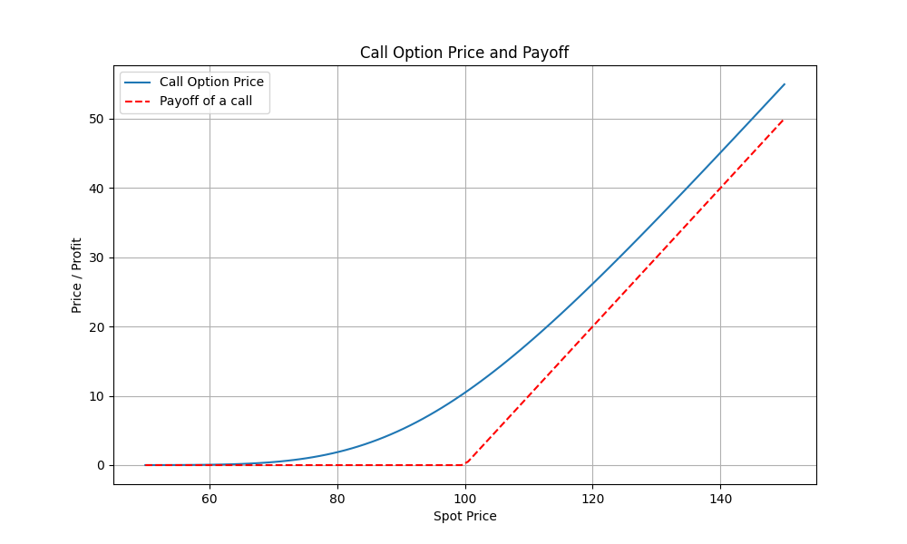
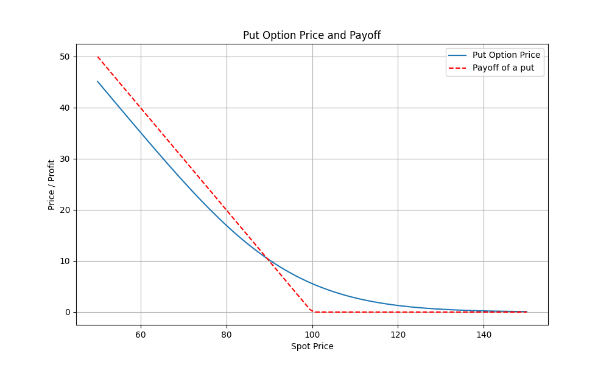
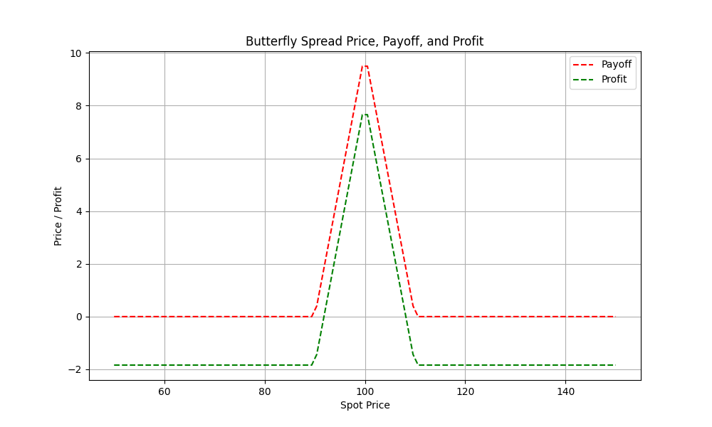

## Option Pricing Tools

This project includes several tools for pricing options and calculating option Greeks using the Black-Scholes model. The tools are implemented in Python and include the following scripts:

### Files

- **[black_scholes_pricer.py](black_scholes_pricer.py)**: Contains functions to calculate call and put option prices using the Black-Scholes formula. It also includes functions to price a butterfly spread using call options and visualize the results.
- **[greeks.py](greeks.py)**: Fetches historical S&P 500 stock data, calculates the delta of the stock price, and uses the Black-Scholes formula to calculate call option prices and deltas. It also visualizes the results over a 2-month period.

### Usage

1. **black_scholes_pricer.py**:
   - Run the script to calculate and visualize call and put option prices, payoffs, and profit patterns.
   - There is also the payoff and profit of a butterfly spread with call options


2. **greeks.py**:
   - Run the script to fetch historical S&P 500 data, calculate deltas, and visualize call option prices and deltas over a 2-month period.


3. **Moving variables for BS.py**:
    - This is a jupyter notebook that allow to move the sliders for variables and feel the movements in the pricings of the put and call options.

### Dependencies

Ensure you have the following Python packages installed:
- `numpy`
- `scipy`
- `matplotlib`
- `pandas`
- `yfinance`

You can install the dependencies using pip:
```sh
pip install numpy scipy matplotlib pandas yfinance
```

### Plots

#### Call Option Price and Payoff


#### Put Option Price and Payoff


#### Butterfly Spread Price, Payoff, and Profit

